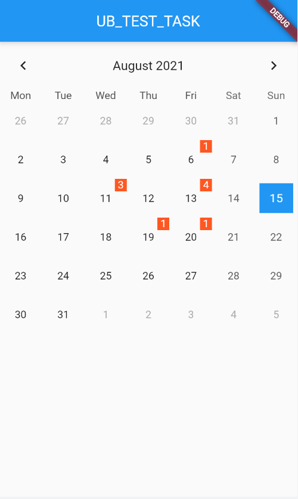
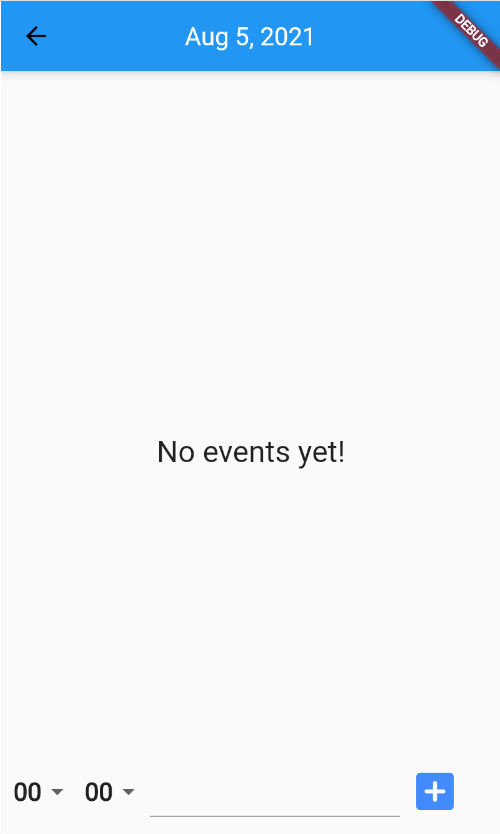
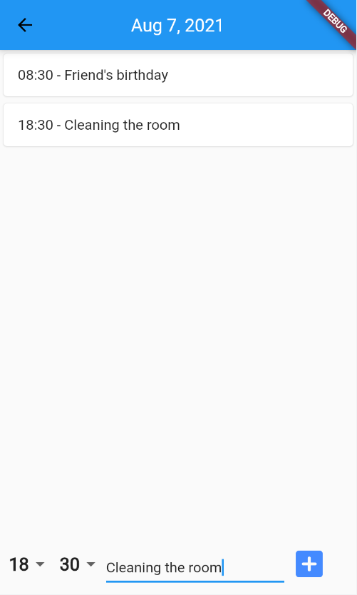

# Calendar
Приложение с использованием Flutter, Hive.

# UbTestTask
Есть возможность добавления событий в календарь.

## Screenshots from the program

Календарь

Второй екран приложения, если по этой дате нету событий

Второй екран приложения, если события есть

